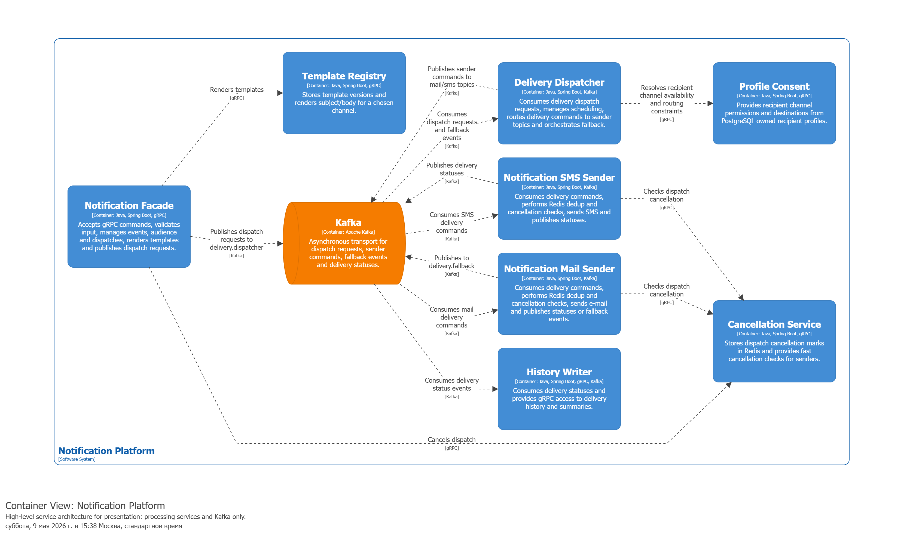
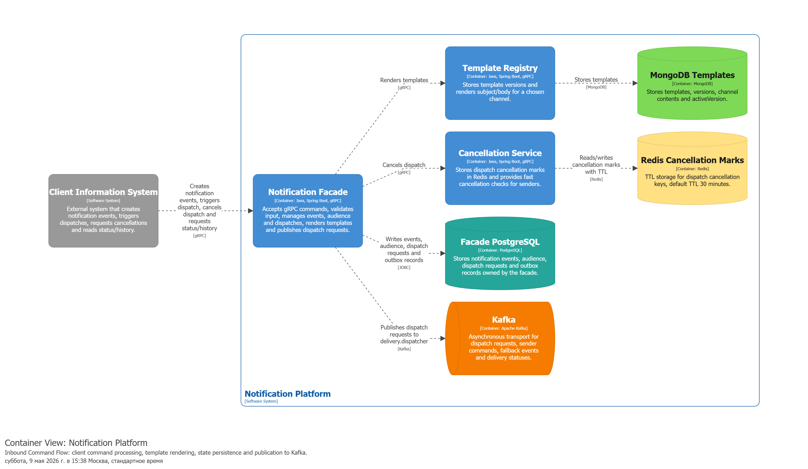
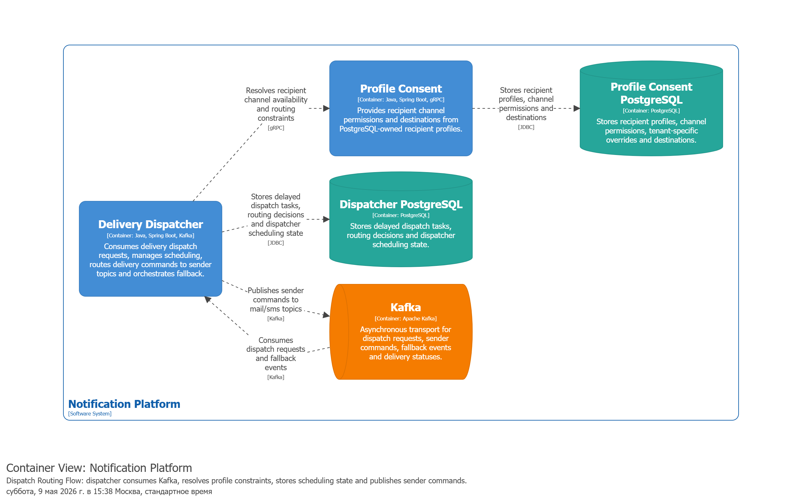

# Платформа доставки уведомлений

Проект ВКР: отказоустойчивая распределённая платформа мультиканальной обработки уведомлений в микросервисной архитектуре.

Платформа принимает уведомительные события от клиентских систем, сохраняет принятые команды, запускает мгновенную или отложенную доставку, маршрутизирует сообщения в канальные сервисы отправки и фиксирует статусы. Гарантия доставки ограничена внутренним контуром платформы: сохранность принятого события, безопасная повторная обработка, дедупликация, повторные попытки, резервная маршрутизация и запись статуса. Физическая доставка пользователю зависит от внешних email/SMS-провайдеров.

## Общая архитектура

Общая схема показывает состав сервисов и основные хранилища. Детальные потоки вынесены в отдельные диаграммы, чтобы не перегружать контейнерную схему стрелками.



Ключевые сервисы:

| Сервис | Ответственность | Хранилище |
|---|---|---|
| `notification-facade` | Приём команд, валидация, аудитория, запуск доставки, идемпотентность | PostgreSQL |
| `template-registry` | Хранение и рендеринг шаблонов | MongoDB |
| `profile-consent` | Проверка профиля, согласий, каналов и контактных данных | PostgreSQL |
| `delivery-dispatcher` | Планирование, маршрутизация, резервная маршрутизация | PostgreSQL |
| `cancellation-service` | Статус отмены доставки с ограниченным временем жизни | Redis |
| `notification-mail-sender` | Доставка email-уведомлений | Redis для дедупликации |
| `notification-sms-sender` | Доставка SMS-уведомлений | Redis для дедупликации |
| `history-writer` | История статусов доставки | ClickHouse |

## Входной контур

`notification-facade` принимает команду от клиентской системы, проверяет входные данные, обращается к шаблонам, сохраняет событие и публикует запрос на доставку в Kafka. Фасад не отправляет сообщения напрямую в канальные сервисы отправки.



## Маршрутизация доставки

`delivery-dispatcher` получает запросы из Kafka, управляет отложенной доставкой, проверяет доступность каналов через `profile-consent` и публикует команды в канальные топики. При финальной ошибке email-доставки он обрабатывает событие резервной маршрутизации и выбирает следующий доступный канал с учётом уже использованных каналов.



## Основные потоки

1. Клиентская система вызывает `notification-facade` по gRPC.
2. Фасад сохраняет событие, аудиторию и запись для публикации в одной транзакции PostgreSQL.
3. Фасад публикует запрос на доставку в Kafka-топик `delivery.dispatcher`.
4. `delivery-dispatcher` выбирает канал и публикует команду в топик email или SMS.
5. Канальный сервис отправки проверяет дедупликацию, статус отмены и профиль получателя.
6. После обработки публикуется статус доставки.
7. `history-writer` сохраняет статус в ClickHouse.

## Технологии

- Java 21/25, Spring Boot, Gradle.
- gRPC и protobuf для синхронных контрактов.
- Kafka для асинхронной обработки.
- PostgreSQL и Flyway для транзакционных данных.
- MongoDB для шаблонов.
- Redis для статусов отмены и технической дедупликации.
- ClickHouse для истории доставки.
- Docker, k3d, Kubernetes, Prometheus, Grafana.

JPA/Hibernate в проекте не используется.

## Локальный запуск

Инфраструктура через Docker Compose:

```powershell
docker-compose -f deploy/docker-compose.yaml up -d
```

Остановка:

```powershell
docker-compose -f deploy/docker-compose.yaml down
```

Сборка проекта:

```powershell
.\gradlew clean assemble
```

Запуск отдельного сервиса:

```powershell
.\gradlew :services:notification-facade:bootRun
.\gradlew :services:delivery-dispatcher:bootRun
.\gradlew :services:notification-mail-sender:bootRun
```

## Тесты

В проекте подключены быстрые модульные и компонентные тесты. Они используют моки репозиториев, Kafka-публикаторов, клиентов профиля/отмены и провайдеров. Для запуска тестов не нужен реальный Kafka, PostgreSQL, Redis, MongoDB, ClickHouse, Docker или k3d-стенд.

```powershell
.\gradlew test
.\gradlew check
```

В GitHub Actions команда `./gradlew clean test` выполняется до деплоя. В отчёте конвейера выводится суммарное количество тестов и разрез по сервисам.

## k3d-стенд

Сборка образов:

```powershell
.\.k8s\build-images.ps1
```

Создание кластера и применение манифестов:

```powershell
k3d cluster create --config .k8s/k3d-config.yaml
kubectl config use-context k3d-notification-platform
kubectl apply -k .k8s
kubectl get pods -n notification-platform
```

## Документация

- `docs/diploma-report` — пояснительная записка ВКР.
- `structurizr/3/workspace.dsl` — C4/Structurizr-модель.
- `docs/plantuml` — PlantUML-схемы данных.
- `docs/dbdiagram` — DBML-схемы для dbdiagram.io.

## Ограничения

- Реализованы два канала доставки: email и SMS.
- Производственная пропускная способность не заявляется.
- Гарантия относится к внутренней обработке платформы, а не к факту прочтения сообщения пользователем.
- Внешние провайдеры остаются ненадёжными зависимостями.
- Redis не является основным хранилищем профиля получателя; профиль и согласия принадлежат `profile-consent` и хранятся в PostgreSQL.
