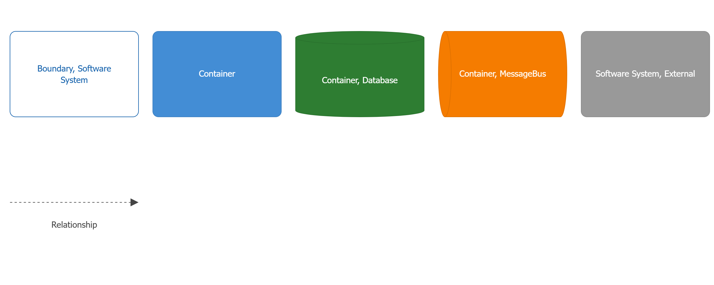
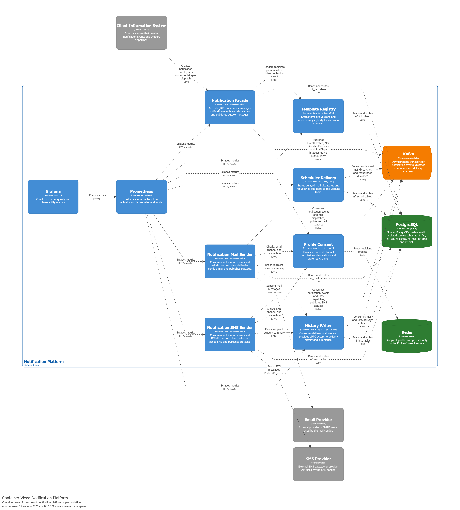
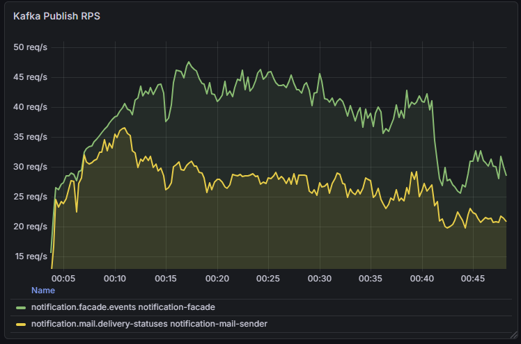
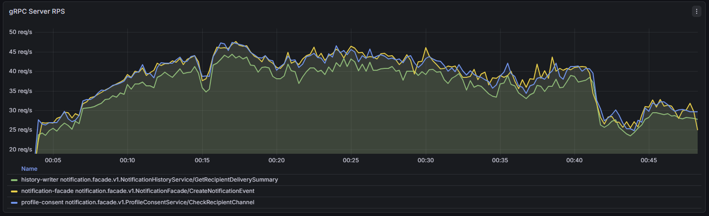

# Notification Platform

Платформа предназначена для приёма событий уведомлений, запуска рассылки по каналам и фиксации итогов доставки. Репозиторий содержит код сервисов, контракты взаимодействия, инфраструктурные конфиги и материалы ВКР.




## Состав системы

`notification-facade`  
Точка входа для клиентских запросов. Принимает события, формирует задания на доставку и публикует сообщения в Kafka через outbox.

`template-registry`  
Сервис шаблонов уведомлений. Хранит шаблоны и версии, отдаёт данные для рендеринга.

`profile-consent`  
Проверка статуса получателя и согласий на каналы доставки. Использует Redis как быстрое хранилище профилей.

`notification-mail-sender`  
Обработка mail-доставки: приём событий из Kafka, планирование, отправка, публикация статусов.

`notification-sms-sender`  
Обработка SMS-доставки по тому же принципу: приём задач, отправка, публикация статусов.

`scheduler-delivery`  
Обрабатывает отложенные задания и переводит их в активные dispatch-события.

`history-writer`  
Фиксирует статусы доставок и отдаёт историю/сводные данные для отчётности.

`custom-loader`  
Нагрузочный генератор: подготавливает тестовые профили и создаёт поток событий для прогонов.

## Сквозной поток данных

1. Клиент отправляет событие в `notification-facade`.
2. Facade публикует событие/dispatch в Kafka.
3. Канальные сервисы (`notification-mail-sender`, `notification-sms-sender`) читают сообщения, проверяют профиль получателя через `profile-consent`, выполняют доставку.
4. Статусы доставки публикуются в Kafka.
5. `history-writer` сохраняет итоги и предоставляет данные для сводок.

## Инфраструктура

Основной локальный контур:
- Kafka + Zookeeper
- PostgreSQL
- MongoDB
- Redis
- Prometheus
- Grafana

Запуск:

```powershell
cd deploy
docker-compose up -d
```

Остановка:

```powershell
docker-compose down
```

## Запуск сервисов

Сборка всего проекта:

```powershell
.\gradlew build
```

Запуск отдельного сервиса:

```powershell
.\gradlew :services:notification-facade:bootRun
.\gradlew :services:notification-mail-sender:bootRun
.\gradlew :services:notification-sms-sender:bootRun
.\gradlew :services:template-registry:bootRun
.\gradlew :services:profile-consent:bootRun
.\gradlew :services:history-writer:bootRun
.\gradlew :services:scheduler-delivery:bootRun
```

## Нагрузочные артефакты

Примеры графиков из последних прогонов лежат в `services/custom-loader/src/main/resources/grafana_07042026`.




Дополнительно:
- `kafka_consume_rps.png`
- `kafka_avg_latency.png`
- `kafka_consume_avg_lat.png`
- `grpc_p50_lat.png`
- `grpc_processing_avg.png`

## Структура репозитория

- `services/` — бизнес-сервисы платформы
- `libs/` — protobuf-контракты
- `deploy/` — docker-compose и конфиги инфраструктуры
- `structurizr/` — архитектурные диаграммы
- `docs/` — материалы ВКР и отчёта
- `.k8s/` — Kubernetes/k3d-манифесты
